# PromoTrack — Help Your Colleagues Get Promoted

  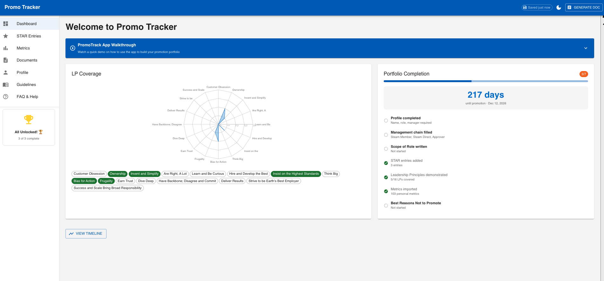

**PromoTrack** is a web application I built to help my colleagues navigate the promotion process and reach their next job level. The promotion journey can be overwhelming — documenting achievements, tracking metrics, covering Leadership Principles, getting manager feedback — and most people don't know where to start or how far along they are.

PromoTrack solves this by giving employees a single place to build their promotion portfolio with clear guidance, AI-powered writing assistance, and a structured path from "I want to get promoted" to "here's my complete promotion document."

---

## The Problem It Solves

Getting promoted requires:
- Writing compelling STAR narratives that demonstrate Leadership Principles
- Tracking performance metrics against level expectations
- Getting manager alignment and feedback early
- Generating a promotion document in the correct format
- Knowing which gaps to fill and what "good" looks like at the next level

Most employees struggle with this because the process is scattered across wikis, templates, and tribal knowledge. **PromoTrack brings it all together in one guided experience.**

---

## Key Features

### 📊 Dashboard — Know Where You Stand

A real-time view of your promotion readiness with a Leadership Principles coverage radar chart and a portfolio completion checklist. Set your target promotion date and see a countdown to keep you focused.

  

### ⭐ STAR Narratives — Build Your Promotion Story

Guided prompts help you write STAR entries across key promotion dimensions: Ambiguity, Scope & Influence, Execution, Problem Complexity, Communication, Impact, and Process Improvement. Start from scratch or use pre-built templates.

  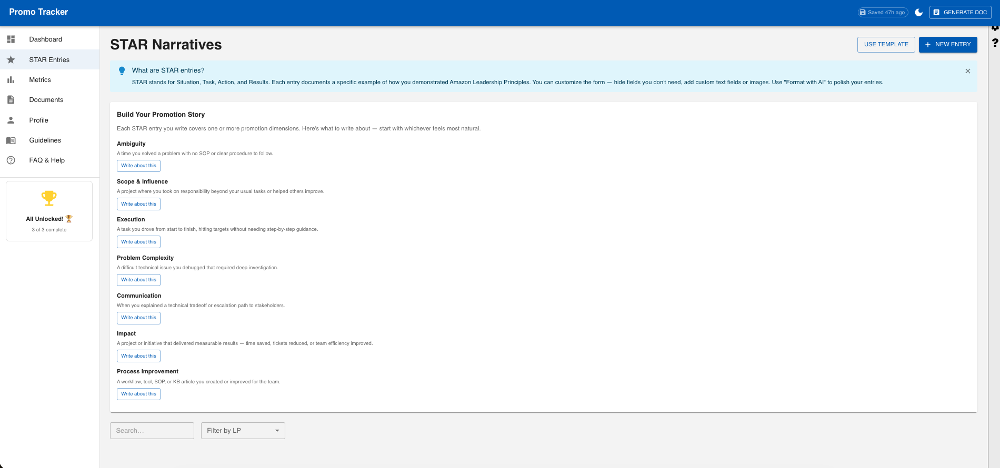

  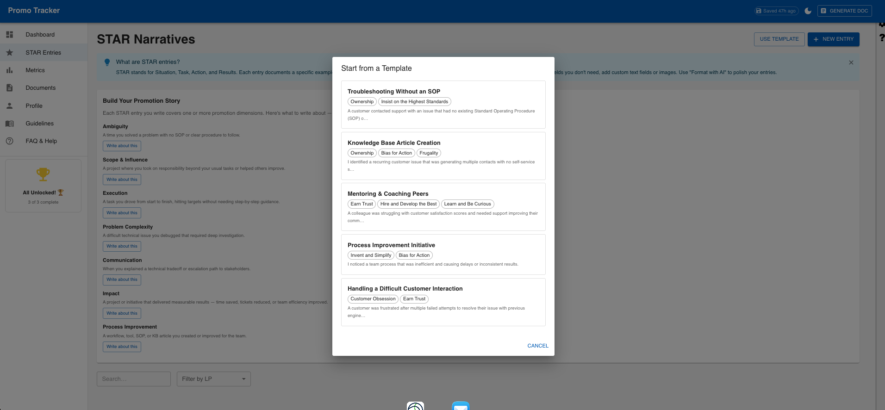

### 🤖 AI-Powered Writing Improvement

Write your rough draft, then let AI polish it into professional, promotion-ready language. Give custom instructions like "make it longer and more professional" and selectively apply the improvements.

  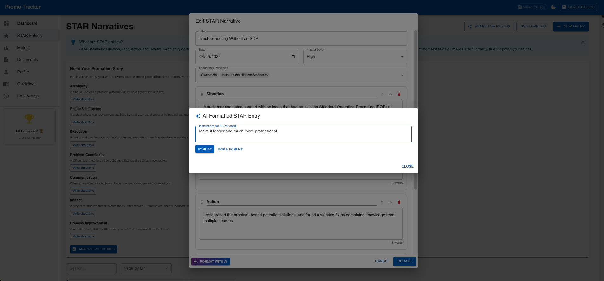

  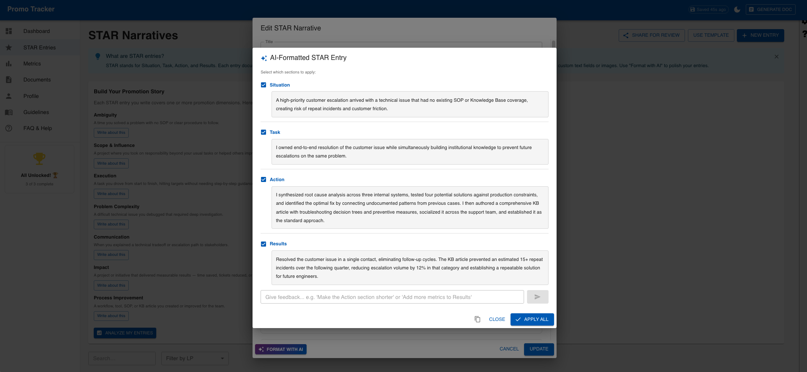

### 📈 Metrics Tracking — GSD Scorecard

Import your GSD Scorecard PDF to automatically extract performance metrics. Visual progress bars show green (meeting target) or red (below target) at a glance, so you know exactly where you stand against level expectations.

  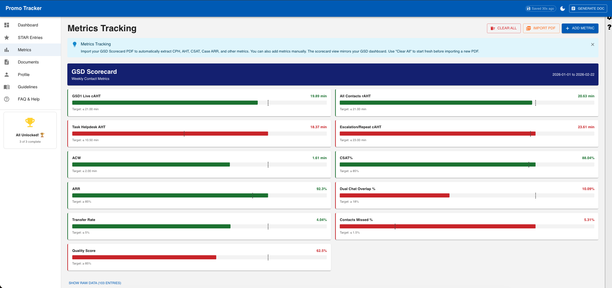

### 📄 Document Generation

Preview and generate your promotion document in the official format — complete with employee information, scope of role, performance strengths, and all your STAR narratives organized by Leadership Principle.

  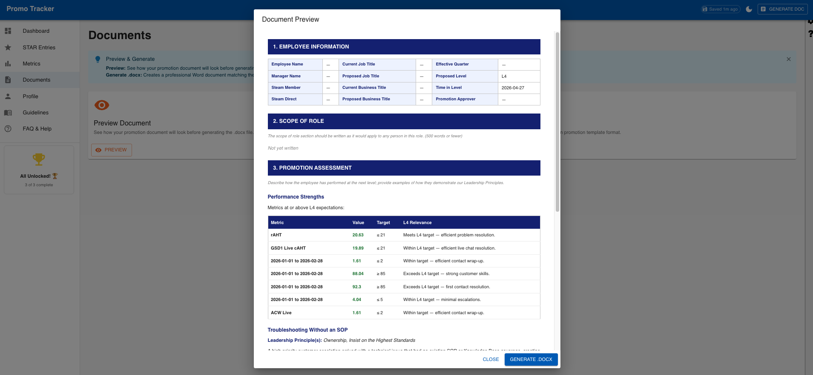

### 👥 Manager Review Workflow

Share your portfolio with your manager via a single link. They can review each STAR entry and leave feedback directly in the app — no more back-and-forth emails or shared documents.

  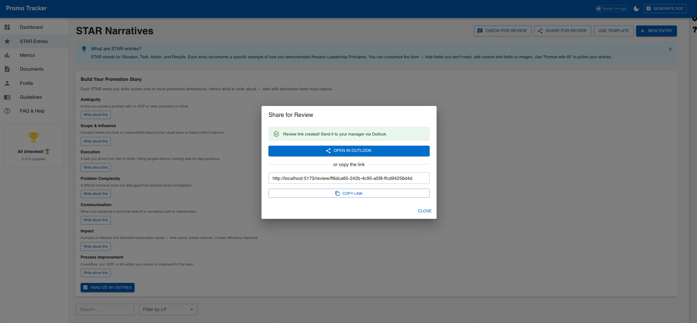

  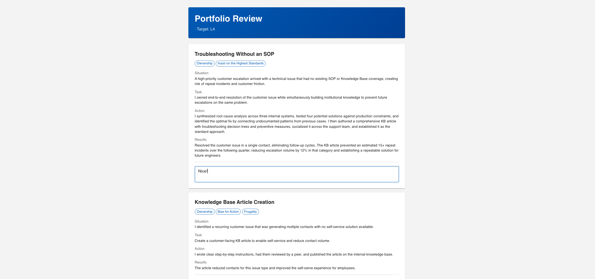

### 👤 Profile & Scope of Role

Capture your employee information, management chain, and scope of role — all fields that feed directly into the promotion document.

  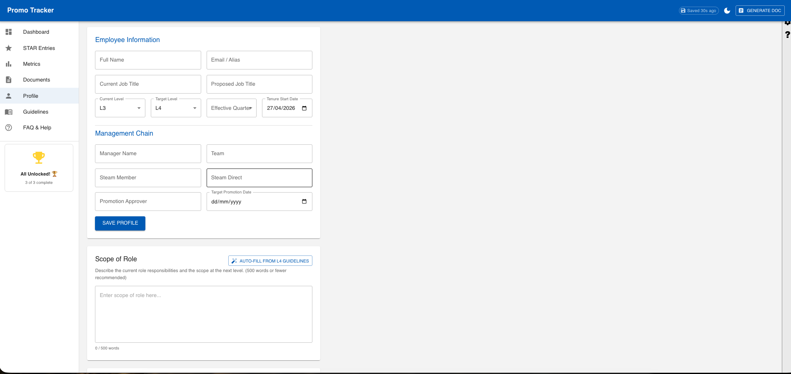

### ❓ Built-in Guidance

A comprehensive FAQ covering everything from "What should I do first?" to "How many STAR entries do I need?" — organized by category so colleagues can self-serve answers.

  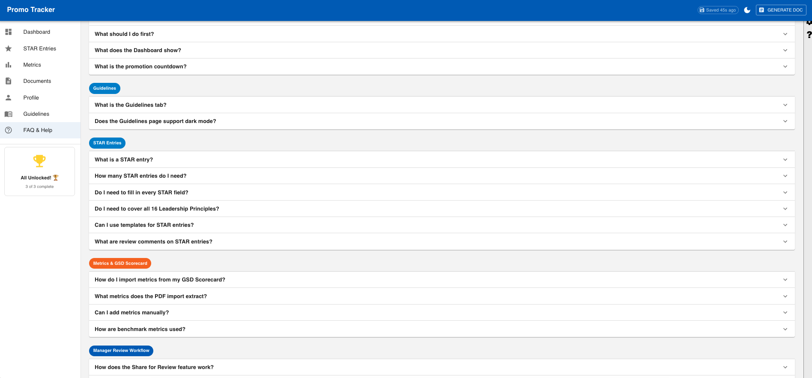

---

## How It Helps People Get Promoted

| Challenge | How PromoTrack Helps |
|-----------|---------------------|
| "I don't know where to start" | Progressive onboarding guides you step by step |
| "I can't write good STAR entries" | Templates + AI formatting turn rough notes into polished narratives |
| "I don't know which LPs I'm missing" | Radar chart shows coverage gaps at a glance |
| "My metrics are scattered" | One-click PDF import from GSD Scorecard |
| "I need manager feedback" | Share link → manager reviews → comments appear in your entries |
| "I don't know what the next level looks like" | Built-in level guidelines (L3→L6) with dimension breakdowns |
| "I need to generate the promo doc" | One-click document generation in the official format |

---

## Tech Stack

- **Frontend:** React 19 + TypeScript + Material UI 7
- **Build:** Vite 8
- **Backend:** AWS SAM (Lambda + DynamoDB + API Gateway)
- **AI:** AWS Bedrock (Claude) for STAR entry improvement
- **Charts:** Recharts for LP coverage radar
- **Documents:** DOCX/PDF generation and parsing

---

## Screenshots Gallery

| Feature | Screenshot |
|---------|-----------|
| Dashboard (empty state) | 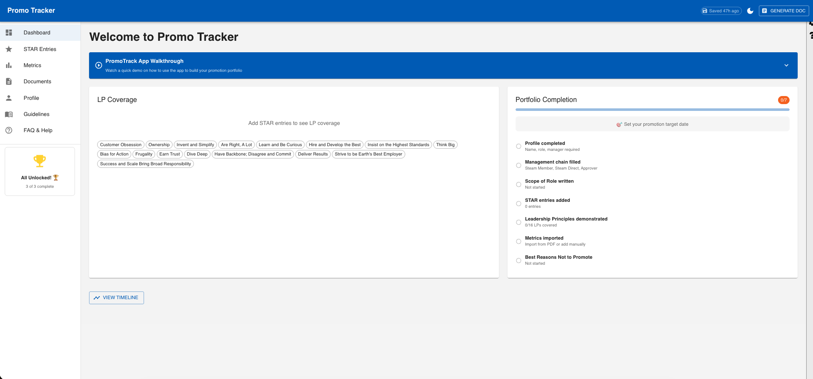 |
| Dashboard (with progress) |  |
| STAR Narratives |  |
| STAR Templates |  |
| STAR Editor | 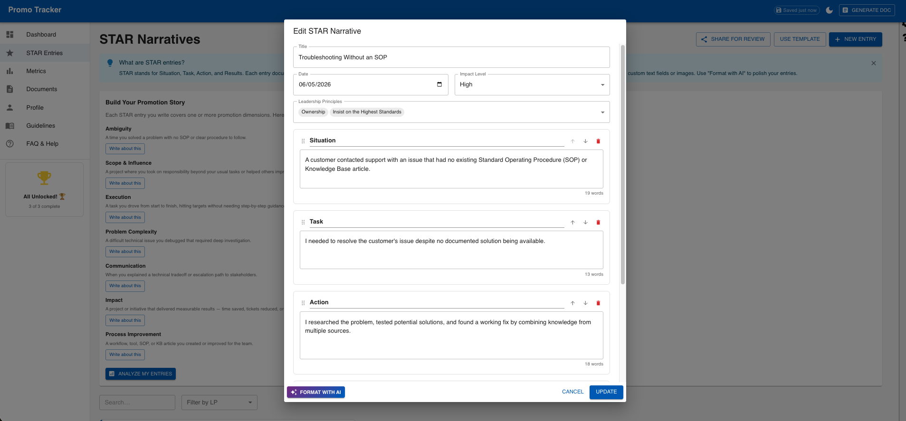 |
| AI Formatting |  |
| AI Output |  |
| STAR Cards | 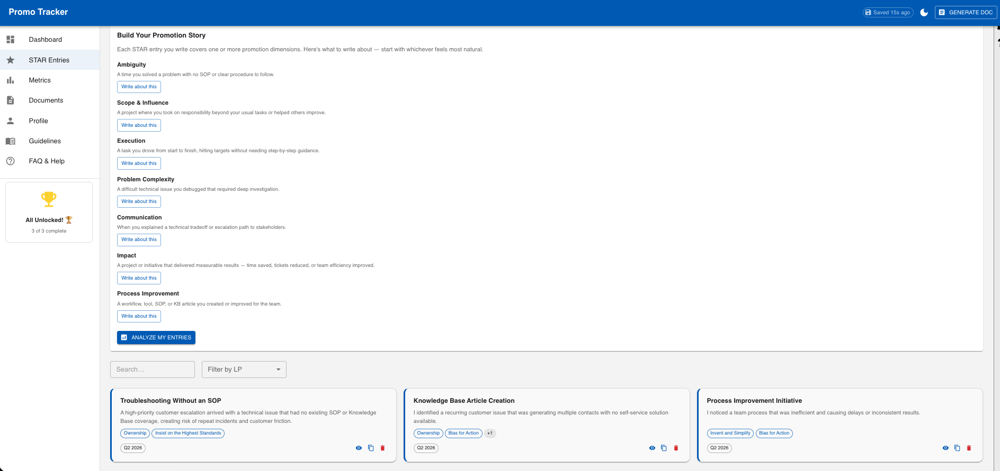 |
| Metrics Scorecard |  |
| Document Preview |  |
| Share for Review |  |
| Manager Review |  |
| Review Submission | 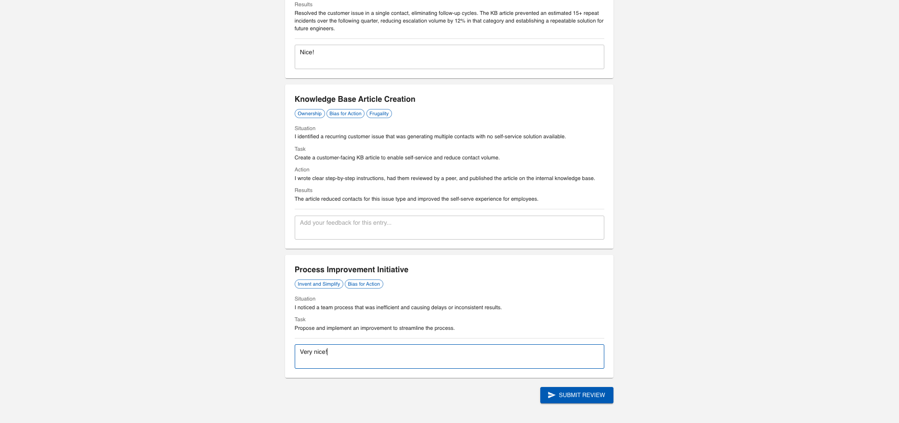 |
| Comments Submitted | 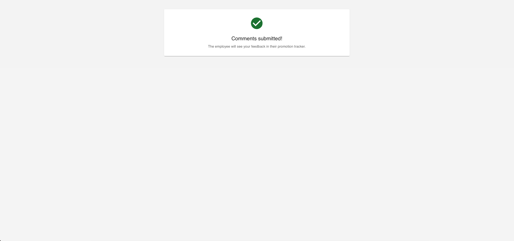 |
| Entry with Feedback | 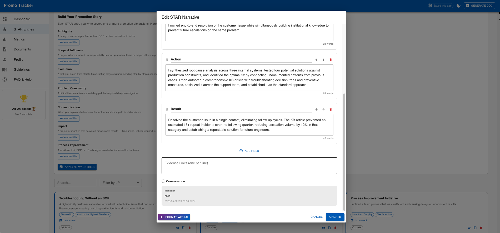 |
| Profile |  |
| FAQ |  |

---

## License

Built with ❤️ to help colleagues reach their next level.
